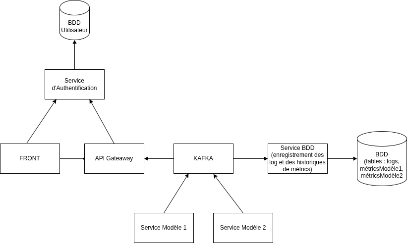

# projet-microservice

## Description

Ce projet est une architecture de microservices composée de plusieurs services indépendants pour comparer 2 librairie dans l'entrainement d'un même modèle selon des métriques comme le cpu, la ram, l'accuracy. Il inclut une API principale, un frontend web, un service d'authentification, de logging, et d'entraînement de modèles de classification sur la base de donnée CIFAR100 qui contient 60000 images et 100 classes dont 20 super classe (PyTorch et TensorFlow).

## Technologies Utilisées

- **Backend** : Python, FastAPI
- **Frontend** : React, Vite, JavaScript
- **Machine Learning** : PyTorch, TensorFlow/Keras
- **Conteneurisation** : Docker, Docker Compose
- **Base de données** : PostgreSQL


## Installation

1. Clonez ce repository suivant :

  ```bash
  git clone https://github.com/pikmin53/projet-microservice
  cd projet-microservice
  ```

2. Docker et Docker Compose doivent être installés.

## Lancement

Pour démarrer le projet, la commande suivante a executé dans le dossier projet-microserice :

```
docker compose up --build
```

L'application sera accessible sur :

- Frontend : http://localhost:5173 
- API : http://localhost:8000 
- Authentification : http://localhost:8001
- Adminer : http://localhost:8080

Pour arrêter les dockers :

```
docker compose down
```

## Services Détaillés

### API (api/)
- **Port** : 8000
- **Description** : API principale avec FastAPI.
- **Endpoints** : Consultez la documentation automatique sur http://localhost:8000/docs une fois lancé.

### Frontend (front/)
- **Port** : 5173
- **Description** : Application React avec Vite pour le front.

### Service Authentification (service_authentification/)
- **Description** : Gère l'authentification et l'autorisation pour les utilisateurs.
- **Endpoints** : Consultez la documentation automatique sur http://localhost:8001/docs une fois lancé.

### Service Log (service_log/)
- **Description** : Enregistre les logs de l'application.

### Service d'affichage BDD (adminer)
- **Description** : Permet de vérifier que les informations se stock bien en BDD. L'affichage du nombre de ligne semble parfois incorrecte mais la base de données l'est.
- **Accés** : Par le lien http://localhost:8080 en choisissant postgre et utilisant les identifiants :
#### BDD user
- POSTGRES_USER_USER=user
- POSTGRES_USER_PASSWORD=password
- POSTGRES_USER_DB=user_db
#### BDD API
- POSTGRES_API_USER=user
- POSTGRES_API_PASSWORD=password
- POSTGRES_API_DB=api_db

### Services Training (services_training/)
- **PyTorch Model** : Modèle de réseau de neurones convolutionnel (CNN).
- **TensorFlow Model** : Modèle CNN avec Keras.

## Schéma de l'architecture


## Utilisateurs par défault : 
### UserAdmin1
- email : georgette.cy@coucou.com
- password : password

### UserAdmin2
- email : victor.tech@coucou.com
- password : password

### User1
- email : laura.carotte@coucou.com
- password : password

### User2
- email : george.cy@coucou.com
- password : password

### User3
- email : petit.prince@coucou.com
- password : password